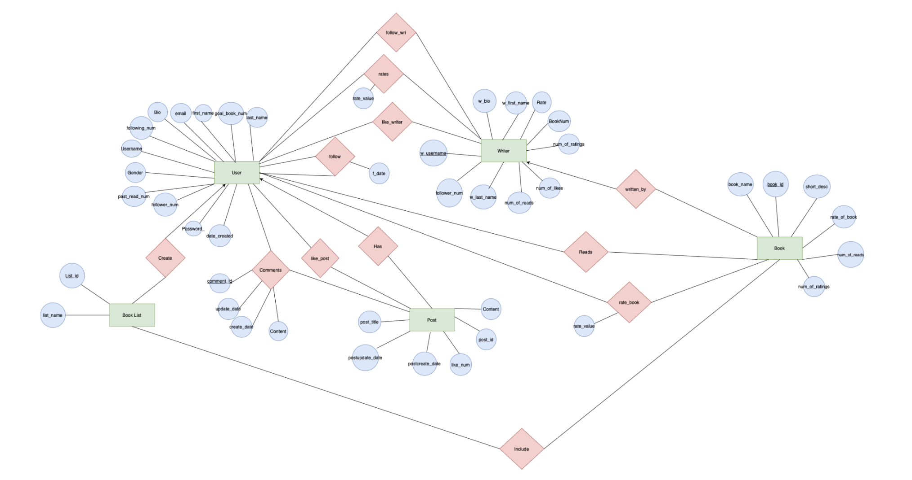
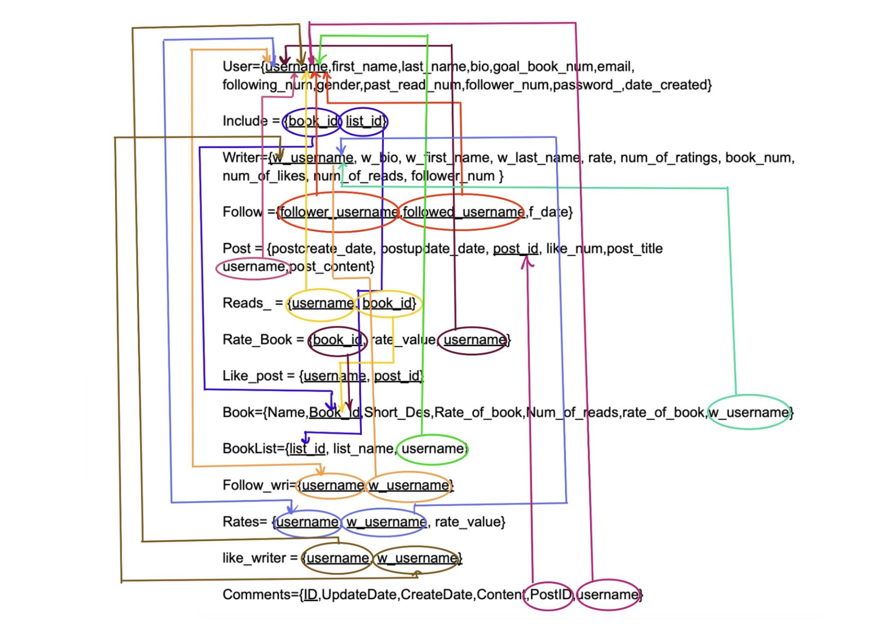
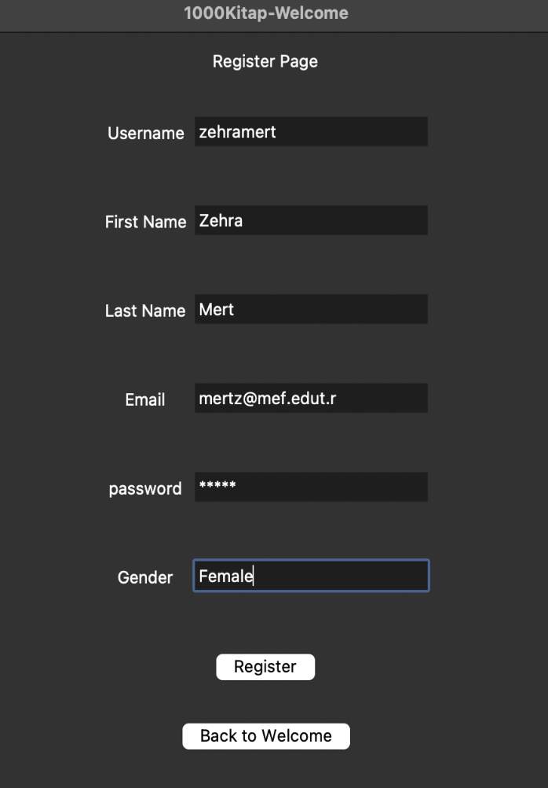
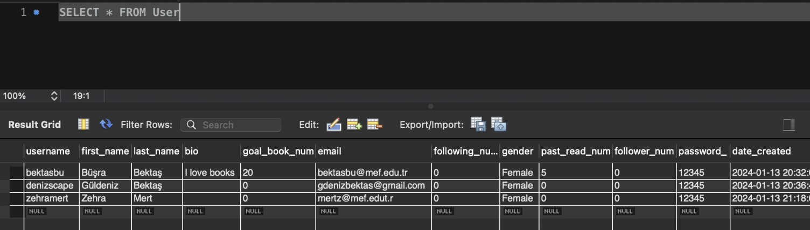
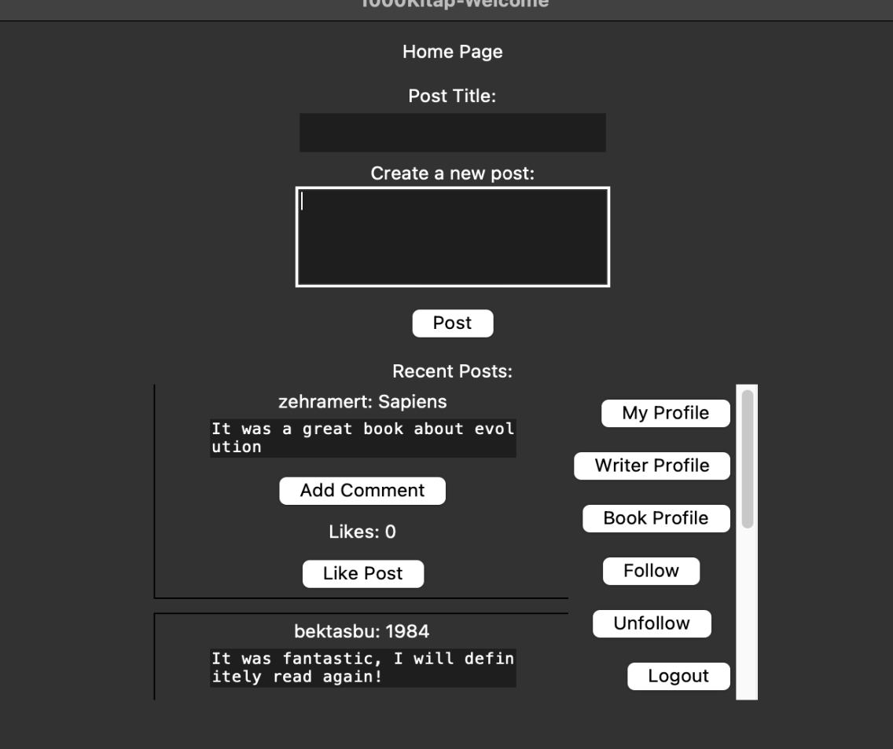
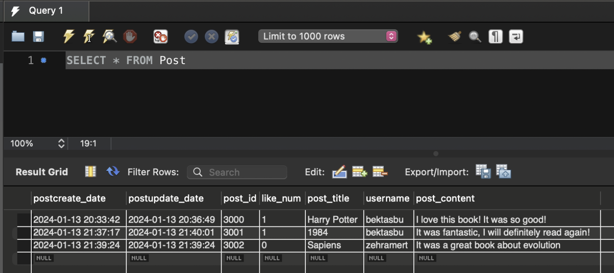

## PROJECT DESCRIPTION
In this project, we tried to implement the database of the book review and interaction page called 1000Kitap and we wanted to show that this database works with an interface.
1000kitap is a platform that aims to popularize book reading. It is a social network where users can review books and interact with each other. It helps users choose the book to read next. Users can mark the books they have read and want to read on their profiles. While marking, they can add whether they liked the book or their opinions about the book and rate the book.In short, this project brings people together and allows them to share their book-oriented experiences.
Based on these features, I have created an interface where users can share posts, comment and interact with each other. Users will be able to view and rate the books and writers and benefit from many other features. This interface ensures that the data was recorded in the database in accordance with the ER diagram and the DB schema, performing many operations with the data in this database using SQL queries.
The GUI has been designed with Python Tkinter.

## ER DIAGRAM

## DB SCHEMA

## INTERFACE

